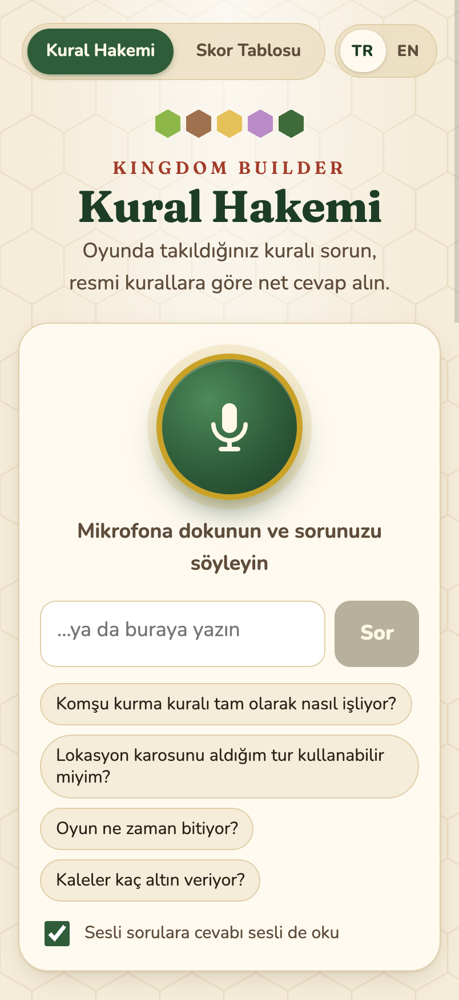
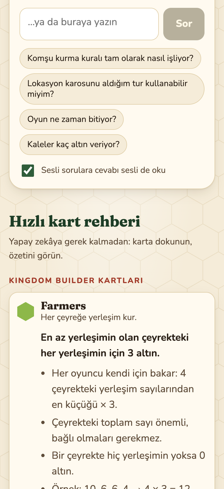
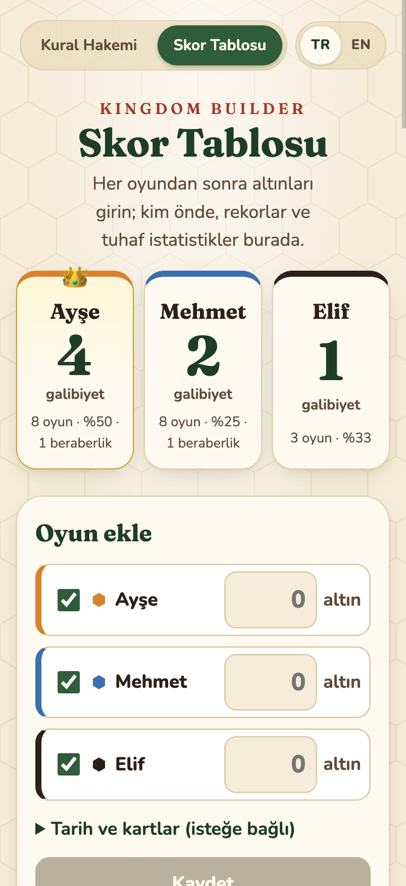
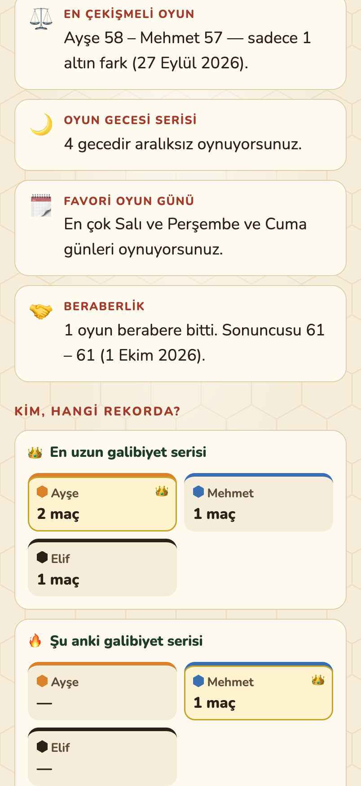

# Kingdom Builder · Kural Hakemi / Rules Referee

A voice-first rules referee and scoreboard for the board game **Kingdom Builder**. Turkish by default, English with one tap.

**Live app:** https://kingdom-builder-rehber.vercel.app · **Project page:** https://armanalis.github.io/kingdom-builder-rehber/

<p>
  
  
  
  
</p>

## Features

- **Ask out loud or type.** You get a short, precise answer grounded in the official rulebook, e.g. "For Farmers, does each quarter count separately, and do settlements need to be connected?" Card and tile names stay in English, as printed on the components.
- **Answers read aloud** for spoken questions.
- **Quick card guide** for all 10 Kingdom Builder cards and 8 location tiles, which works without any AI.
- **Scoreboard for 2–5 players** shared across every phone: wins, record margin, closest game, winning and losing streaks, revenge rate, lucky card, game-night streak and more.
- **First-visit onboarding** where players type their own names, a **TR / EN** switch, and layouts for phones and desktop.

## How it works

1. **Listening:** the phone's built-in dictation (Web Speech API) turns speech into text. If the browser can't do that, a short recording is transcribed by Gemini.
2. **Answering:** the question and the rules reference in [`lib/rules.ts`](lib/rules.ts) go to Google Gemini on the free Gemini API tier (`gemini-3.8-flash`, falling back to `gemini-2.5-flash` when its daily limit is reached). Without a Gemini key, the app uses Vercel AI Gateway (`openai/gpt-5.2`) instead. See [`lib/ai.ts`](lib/ai.ts).
3. **Speaking:** the phone's built-in text-to-speech reads the answer.

Scores are stored as one private JSON document in Vercel Blob ([`lib/scoreStore.ts`](lib/scoreStore.ts)).

**Stack:** Next.js 16 (App Router) · React 19 · Vercel AI SDK 7 · Google Gemini API · Vercel Blob.

## Run locally

```bash
npm install
vercel link && vercel env pull   # AI Gateway (OIDC) + Blob credentials
npm run dev
```

Without Blob credentials, or with `SCOREBOARD_STORE=file`, scores are saved to `.data/scoreboard.json`.

| Variable | Default |
| --- | --- |
| `GOOGLE_GENERATIVE_AI_API_KEY` | free key from Google AI Studio; when set, Gemini is used |
| `GEMINI_MODELS` | `gemini-3.8-flash,gemini-2.5-flash` |
| `AI_GATEWAY_MODEL` | `openai/gpt-5.2` |
| `AI_GATEWAY_FALLBACK_MODELS` | `google/gemini-2.5-flash` |
| `AI_GATEWAY_TRANSCRIBE_MODEL` | `openai/gpt-4o-mini-transcribe` |
| `BLOB_READ_WRITE_TOKEN` | added by Vercel when a Blob store is connected |

## Türkçe

Kingdom Builder için sesli kural hakemi ve skor tablosu. Kuralı sesli sorun ya da yazın; resmi kural kitabına dayanan kısa ve net bir cevap alın, isterseniz sesli dinleyin. Skor tablosu 2–5 oyuncuyu destekler: galibiyetler, rekor fark, seriler, rövanş oranı, şanslı kart ve daha fazlası. Site varsayılan olarak Türkçedir; sağ üstten İngilizceye geçilebilir.

---

Unofficial fan project. Kingdom Builder is designed by Donald X. Vaccarino and published by Queen Games.
